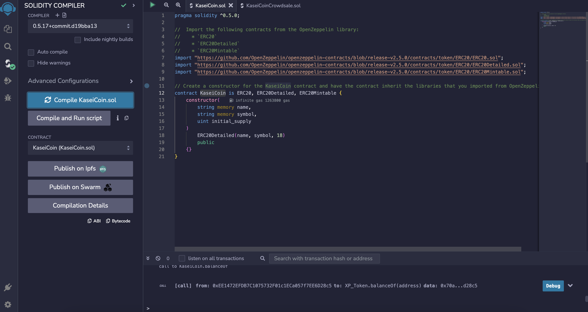

# Unit 21: Martian Token Crowdsale

## Background

KaseiCoin will be a fungible token that’s ERC-20 compliant. I will launch a crowdsale that will allow people who are moving to Mars to convert their earthling money to KaseiCoin.

## Files

[KaseiCoin.sol](KaseiCoin.sol)

[KaseiCoinCrowdsale.sol](KaseiCoinCrowdsale.com)

## Instructions

The steps for this assignment are divided into the following subsections:

1. Create the KaseiCoin Token Contract

2. Create the KaseiCoin Crowdsale Contract

3. Create the KaseiCoin Deployer Contract

4. Deploy and Test the Crowdsale on a Local Blockchain
[Deploying The Contract Video](/Videos/deploying_contract.mov)
